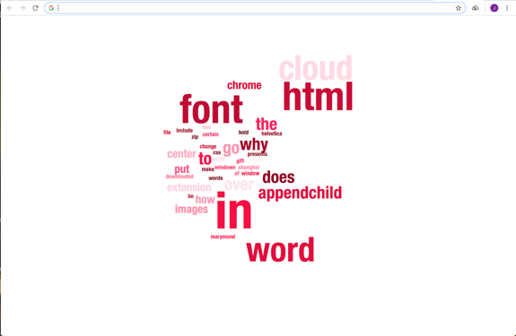

# Cloud-of-your-History
Final Project for 'INTM-SHU 120 Communications Lab'

**1.	Title**  
Cloud of Your History

**2. Subtitle**  
A Chrome extension that reads the local web history of the past 24 hours and creates a word cloud of Google searched words

**3. Description**  
I created a Chrome extension that displays a word cloud of the words the users searched on Google for the past 24 hours every time they open up a new tab in Chrome. Using Chrome history API, I extracted keywords from the visited URLs and randomly placed them on the html page with the size of the words representing the searched frequency.

**4. Demo of Project**  
http://imanas.shanghai.nyu.edu/~yj1254/internet_art

Above is the website where I explained about the project along with a link to download the extension and an instruction for installation.

 
 
Fig. 1. Screenshots of New Tab when the extension is installed

**5. Conceptual Development**  
The main goal of my final project was to use an actual live data and display that in a visually engaging form. Some of the API sources I’ve considered were flight API, web history API, and NASA API. I was hesitating between delivering one single powerful message to the users or providing an interactive platform where the users can use for a small fun. I thought person-specific data, such as search history and web visit history, can show one’s subconsciousness about what have been on their mind recently. After a few brainstorming, both of myself and with professor, I decided to use texts to indirectly represent what the user was interested in and curious about. Sources of those recent thoughts would be the web visit URLs and Google search history.

**6. Technical Development**  
Development of my project can be categorized into three parts. Starting from accessing web history, then to extracting searched words from the URLs, and lastly creating a word cloud. I thought it would be too complicated to put all the functions in one single code folder from the beginning, so I created several prototypes to test if each function is executed successfully, and then merged them afterwards.

‘prototype_gettitle’ tests the array of if statements to get the starting points and end points of searched words in each URLs. I found out that most of the Google search URLs can be categorized into four different types: 
-	~~ search?q= (search words) &oq= (search words) &ogs ~~
-	~~ search?q= (search words) &source ~~
-	~~ search?ei= ~~ &q= (search words) &oq= (search words) &gs ~~
-	~~ search?biw= ~~ &q= (search words) &oq= (search words) &gs ~~
Starting points are found by searching for ‘q=’ using search() function. End points are found by searching for either ‘&oq=,’‘&source,’ ‘&spell,’ or ‘&sa’. After that, slice() function stores each words into the array finalstring by recognizing + sign in between the words.

‘prototype_chromehistory’ is a modified code of an example code of viewing recently visited URLs provided by Chrome. I changed it to appear in a new tab instead of a popup, and specifically searched for the URLs that include a keyword ‘search.’ These URLs appear on the html page using function appendChild(). 

‘prototype_extension’ tests the formation and installation of a chrome extension. In order to properly use the Chrome.history API, I had no choice but to create an extension instead of making a static website. I followed an extension making tutorial that I found online and tested the local installation of the extension.

‘prototype_wordcloud’ is a modified version of the code I found online from the Codepen. It creates a word cloud out of an array of string and displays it on the html page. I changed the codes so that the font size of each word represents the searched frequency and the color is randomized every time the user reloads the page with the word having the same hue but varying lightness.

After the final project presentation on Wednesday, I was suggested to make the screen simpler and nicer-looking. So I removed the list of URLs in the left side of the window. Now, only the word cloud is displayed in the center of the window. 

**7.	Lessons Learned**  
I truly enjoyed working on this project. In the beginning, I had a vague concept in my mind what I would like to create on the web page. As I started looking for exemplary codes online and modified them myself to make different set of codes be executed successfully along with each other, I learned to create a Chrome extension - how it works, what kind of information I have to ask for to properly access the API, and how I can install and implement it locally -, and to understand and analyze the codes previously developed by other people and modify them in a way that suits my needs. Most importantly, I learned to efficiently work on a project by dividing functions into different code folders and testing them separately before merging everything altogether. It was a very fruitful process and I had a lot of fun, even when I was suffering to figure out what is happening in the codes and how to make things to happen as I imagined them to be.

**8. Attributions**  
Codes for accessing the web history through Chrome.history API are based on the example code provided by Chrome (https://chromium.googlesource.com/chromium/src/+/master/chrome/common/extensions/docs/examples/api/history/showHistory/). Codes for creating a word cloud are based on the example code found on the Codepen (https://codepen.io/stevn/pen/JdwNgw). I would like to thank Professor Moon for helping me with brainstorming, organizing tasks, and giving tips for code development.
